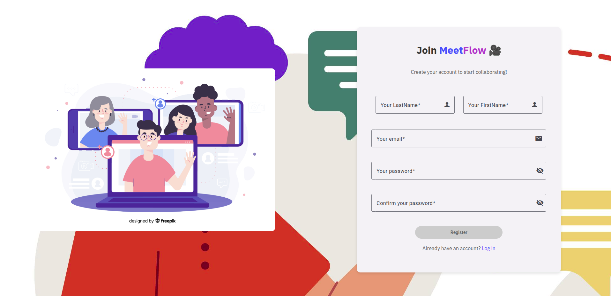
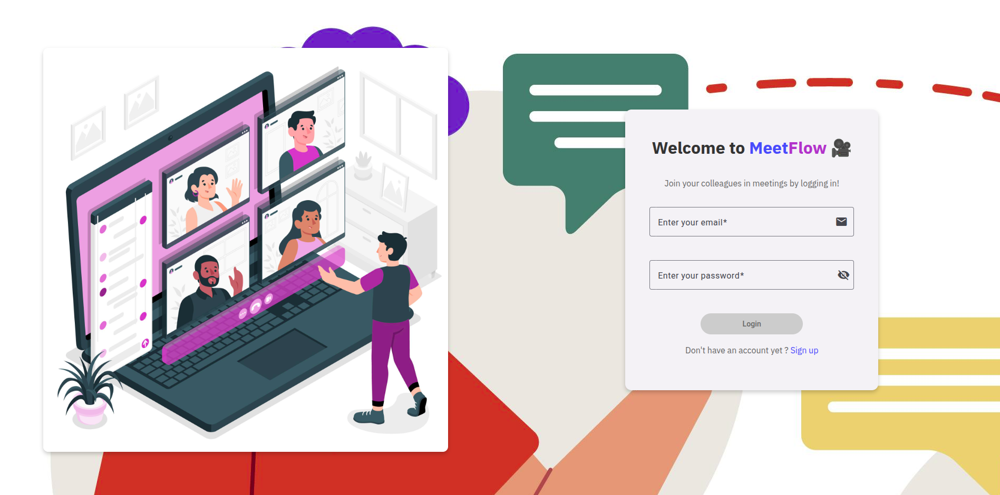
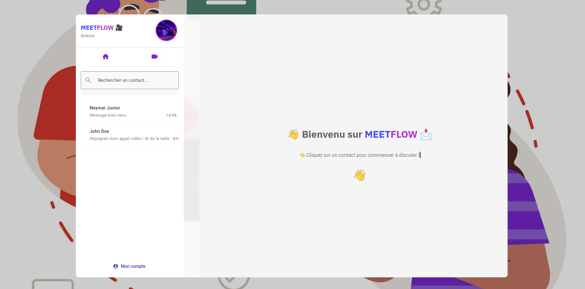
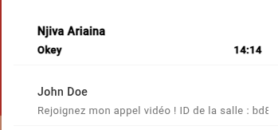
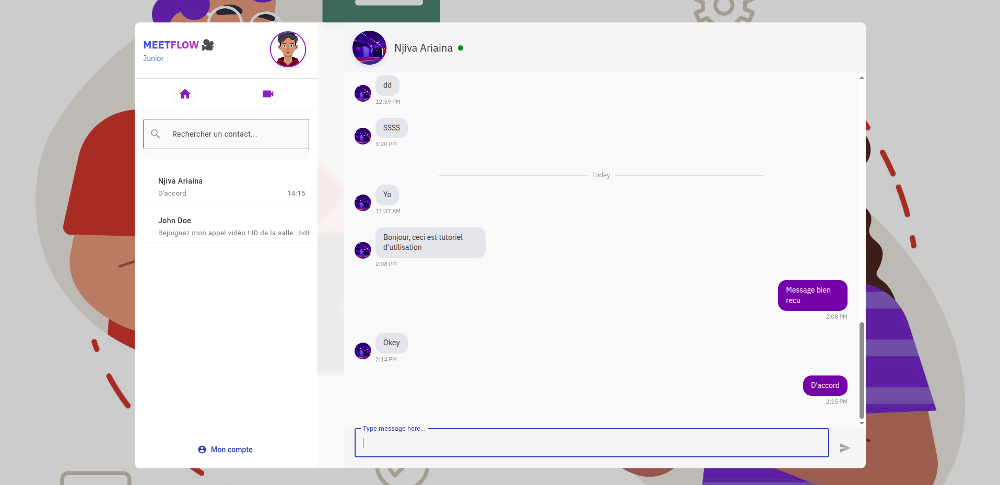
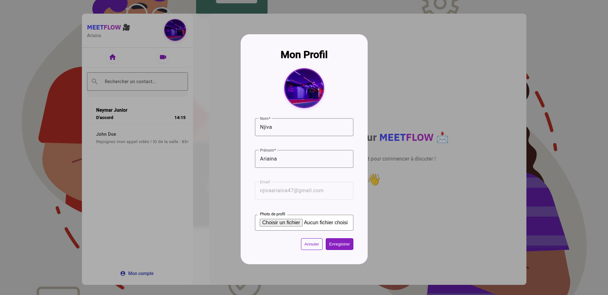
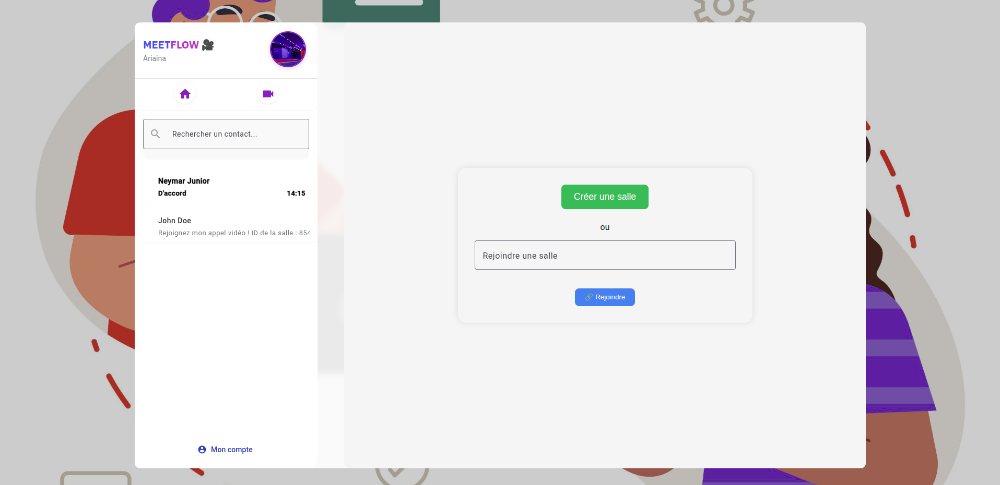
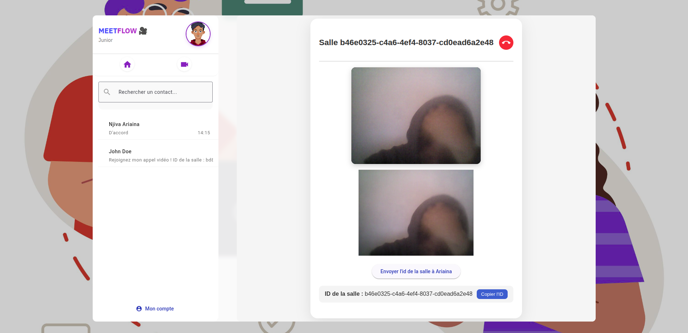

# 🎥 MeetFlow - Application de messagerie et visioconférence en temps réel

**MeetFlow** est une application Angular/Node.js permettant de :

- discuter en temps réel via un système de messagerie privée,
- rejoindre ou créer une salle de visioconférence,
- gérer son profil utilisateur.

## 🚀 Technologies utilisées

### Frontend

- Angular 17
- Angular Material
- Socket.io-client

### Backend

- Node.js + Express
- MongoDB avec Mongoose
- Socket.io (serveur)
- JWT pour l’authentification

---

## ⚙️ Lancer le projet

### 1. Prérequis

- Node.js v18+
- Angular CLI
- MongoDB local ou distant

### 2. Backend

```bash
cd meetflow-backend
npm install
node server.js
````

### 3. Frontend

```bash
npm install
ng serve
```

Accéder à l’app : [http://localhost:4200](http://localhost:4200)

---

## 🔐 Authentification

- Inscription avec prénom, nom, email, mot de passe
- Connexion sécurisée via JWT
- Gestion de session (connexion/déconnexion)

📷 _Capture écran - Inscription et Connexion :_




---

## 🏠 Accueil

Une fois connecté, l’utilisateur accède à la page d’accueil avec :

- son profil
- une barre latérale avec ses contacts
- la dernière conversation

📷 _Capture écran - Accueil :_



---

## 💬 Messagerie

- Liste des contacts
- Affichage des dernières conversations
- Envoi de messages en temps réel avec Socket.io
- Recherche de contact

📷 _Capture écran - Nouvelle conversation et chat :_




---

## 🧑‍💼 Profil

- Affichage des infos personnelles
- Modification de l’image de profil et des informations

📷 _Capture écran - Modification du profil :_



---

## 📹 Visioconférence

- Création ou saisie d’un code de salle
- Rejoint la salle et partage vidéo/audio avec d’autres participants

📷 _Capture écran - Création et appel vidéo :_





## ✨ Fonctionnalités principales

- Authentification sécurisée
- Liste de contacts avec dernière activité
- Messagerie temps réel
- Appels vidéo via WebRTC/Socket.io
- Gestion de profil utilisateur
- Recherche de contact
- UX moderne avec Angular Material

---

## 📌 Auteur

- **Ariaina** – Étudiant en \[Génie Logiciel]
